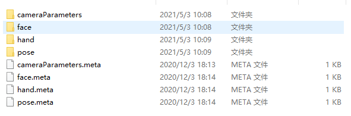
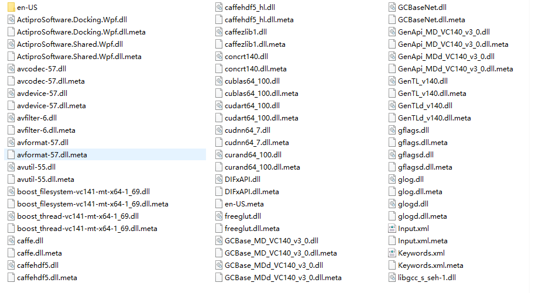

# LiveCharacter

A Live2D Character Animation System Developed Under Unity Framework

## 前言

此系统（软件）用于硕士毕业设计

系统功能旨在将AI与CV及CG结合，快速提取视频中的人体运动并应用于二维角色，生成合理流畅的二维角色动画

原打算用C++开发，但限于时间及各种原因，还是决定用Unity下的C#来快速开发一个Demo出来

此系统将由[Oxine](https://github.com/oxine)和[Keneyr](https://github.com/Keneyr)协作完成

由于文件大小限制，以下两个路径下的文件没有上传(读者请于[OpenPose官方github](https://github.com/CMU-Perceptual-Computing-Lab/openpose_unity_plugin)处下载)：

LiveCharacter\Truck\Assets\StreamingAssets\models

LiveCharacter\Truck\Assets\OpenPose\Plugins

## 开发环境

Win10/Unity2018.3.3f1

## 预备知识

OpenPose人体姿态识别/BP神经网络分类/轮廓检测/网格剖分/骨骼蒙皮/姿态检索/运动对齐

## 原型设计

Game视图下像素分辨率：1024 * 768

Canvas下的Button/Image等组件作为渲染桥梁

1、导入视频并渲染到Video框下

方法：

参考该[博客](https://gameinstitute.qq.com/community/detail/125314),在run模式下，点击按钮，打开本地文件夹，选择特定视频路径

使用Unity自带的Video Player将视频原始数据渲染至Canvas上（由于Unity自带的组件不好用，所以改为AVProVideo插件，参考插件给的Samples及该[博客教程](https://www.cnblogs.com/mrmocha/p/8087389.html)）

2、导入角色图像并显示，原像素进行算法处理，可视化适当缩放，支持png、jpg、psd格式

方法：

rawImage.texture = 打开的图像

3、实时控制台输出，Debug.Log()到Editor编辑器，同时也实时滚动输出到系统界面

方法：

封装Debug.Log()，同时控制场景中的text物体的文字内容刷新

4、对角色图像进行轮廓检测和网格剖分

方法：

Unity源码中，texture转为sprite时，会自动进行轮廓检测和轮廓线采样及网格剖分，可从sprite相关资源中获取信息

微软维护的针对C#的开源Triangulate库可用于德劳内三角网格剖分及曲面细分

为方便操作，所有类我们自定义

5、对角色图像进行骨骼姿态提取，和骨架生成

方法：

调用OpenPose接口，存储rendered图像到本地，然后读取本地图像并渲染到rawImage上；

利用OpenPose生成的json文件中的数据，生成Bone2D类型的骨骼，通过Camera的RenderTargetTexture渲染到RawImage上

6、对角色进行蒙皮

方法：

(这个大概是所有代码里最麻烦的了)

首先生成一个GameObject，添加SpriteMeshInstance组件和MeshFilter组件和SkinnedMeshRenderer组件

其次通过代码设置SpriteMeshInstance下SpriteMesh对应的精灵，及Order in Layer的值

然后通过代码设置SpriteMeshInstance下绑定的Bone这个List，同时更新MeshRenderer一些相关值

调用GL相关渲染代码，进行可视化渲染，到SkinningCamera下，然后快照到BoneBinding小窗口下

7、提取运动和姿态检索

方法：

提取运动--运行OpenPose算法，对视频数据按照用户所选择的帧间隔进行检测，保存渲染好的视频帧图像及json文件(使用归一化的点信息)到本地，根据用户选择的初始帧及帧间隔进行可视化(方便用户交互快速反应，实时计算大概率延迟较高)

8、动画生成

对角色这个GameObject添加Animation组件，通过UI交互上的初始帧和结束帧及帧间隔来设置内存中要重定向的keypoints数据

视频中的keypoints属于0-1，character的keypoints也属于0-1，然后根据character缩放的比例，求得其每根骨骼应该进行的运动偏移量和旋转角，带动角色形变

新生成一个canvas，用来显示动画效果(原图如果过大，则自适应canvas)

## TODO

file dlg filter 打开文件过滤机制偶现bug

debug log 封装后输出程序定位

runtime AssetDatabase.CreateAsset 创建asset资源（后发现创建asset资源只可以Editor模式下，随更改为在runtime模式下存储二进制文件）

由于OpenPose给的接口，只有ImageDirectionary循环对路径下的图片处理，所以无法单独对一张图片进行处理，有待后续C++接口更新，重生成dll文件(目前是把所有image和video单独封到一个文件夹)

OpenPose封装的Wrapper无法将输出信息回调到Console类内, 及无法直接拿混合渲染的图像数据到内存，有待更新c++源码

根据UI控制可视化渲染图bar的位置的代码

用c++写形态学处理等底层算法，不再调用UnityEditor下的函数
> typeof(UnityEditor.Sprites.SpriteUtility).GetMethod("GenerateOutline", BindingFlags.Static | BindingFlags.NonPublic)

GL shader骨骼渲染问题 绑定渲染问题

蒙皮算法 c++ dll

目前姿态检索和提取运动必须是先角色，再视频，然后就不能乱动了，后期希望可以改善一下

change openpose1.5.1 to openpose1.7.0

## 系统使用说明

## 参考文献

Cao Z, Simon T, Wei S E, et al. Realtime multi-person 2d pose estimation using part affinity 
fields[C]//Proceedings of the IEEE conference on computer vision and pattern recognition. 2017: 
7291-7299.

Li, Jing, et al. "Brief introduction of back propagation (BP) neural network algorithm and its 
improvement." Advances in computer science and information engineering. Springer, Berlin, 
Heidelberg, 2012. 553-558.

Suzuki S. Topological structural analysis of digitized binary images by border following[J]. 
Computer vision, graphics, and image processing, 1985, 30(1): 32-46.

Douglas D H, Peucker T K. Algorithms for the reduction of the number of points required to represent 
a digitized line or its caricature[J]. Cartographica: the international journal for geographic information
and geovisualization, 1973, 10(2): 112-122.

Dwyer, Rex A. "A faster divide-and-conquer algorithm for constructing Delaunay 
triangulations." Algorithmica 2.1 (1987): 137-151.

Jacobson, Alec, et al. "Bounded biharmonic weights for real-time deformation." ACM Trans. 
Graph. 30.4 (2011): 78.

